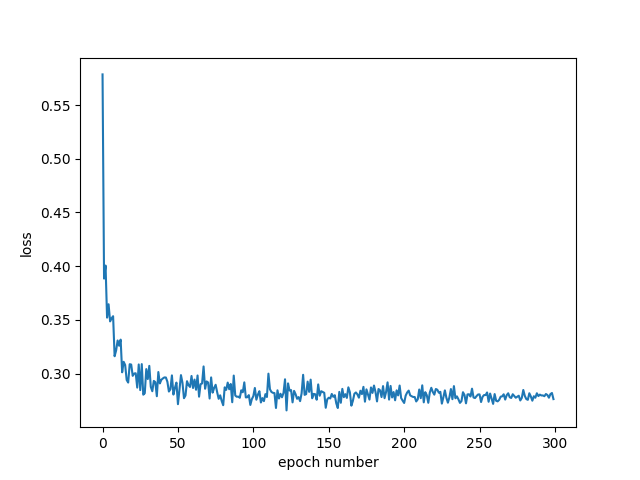
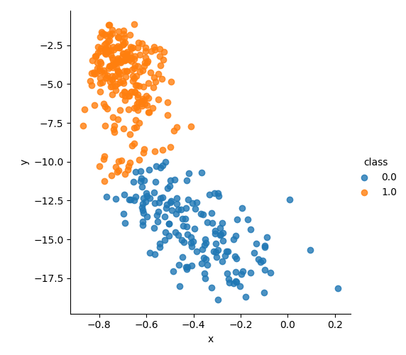
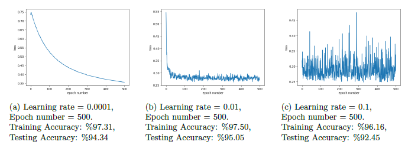
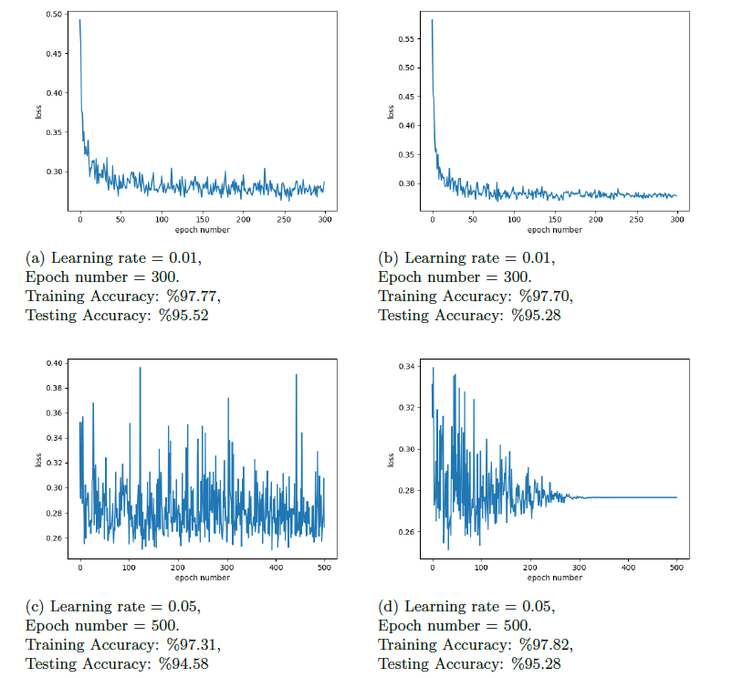

Implementation of logistic regression (LR) using stochastic gradient descent (SGD) algorithm. Numpy functions are used to implement linear algebra operations (in-built functions are not used).

## LRusingSGD.py
        
Run LRusingSGD.py in a Python IDE or the terminal by typing: ```python LRusingSGD.py```

### An example of output is as follow:
```
**************************************************
Logistic Regression using Stochastic Gradient Descent
**************************************************
Accuracy on train data:   97.75784753363229
Accuracy on test data :   95.28301886792453
```

Loss convergence curve 
<p align="center"></p>

Final clusters' generated plot is as follows
<p align="center"></p>


## Results of different experiements

Impact of using different fixed learning rates on loss and accuracy
<p align="center"></p>

Comparison of using fixed and time-based decay learning rate. Results of Figure (a) and (c) are obtained using fixed learning rates and Figure (b) and (d) are obtained with the learning rates generated using time based decay
<p align="center"></p>

## References

J. Shawe-Taylor, N. Cristianini, et al., Kernel methods for pattern analysis. Cambridge university press, 2004.

V. Keselj, "Speech and language processing daniel jurafsky and james h. martin (stanford university and university of colorado at boulder) pearson prentice hall, 2009, xxxi+ 988 pp; hardbound, isbn978-0-13-187321-6, 115:00;00 2009:

I. Goodfellow, Y. Bengio, A. Courville, and Y. Bengio, Deep learning, vol. 1. MIT press Cambridge, 2016.

J. Patterson and A. Gibson, Deep learning: A practitioner's approach. " O'Reilly Media, Inc.", 2017.

J. Park, D. Yi, and S. Ji, "A novel learning rate schedule in optimization for neural networks and it's convergence," Symmetry, vol. 12, no. 4, p. 660, 2020.

##### This project was implemented for CmpE 544 Pattern Recognition Course of Bogazici University.
